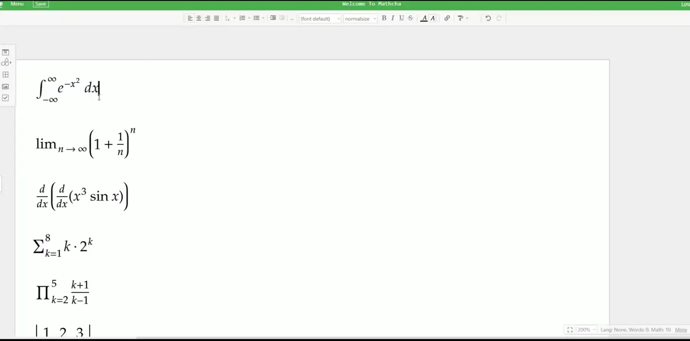
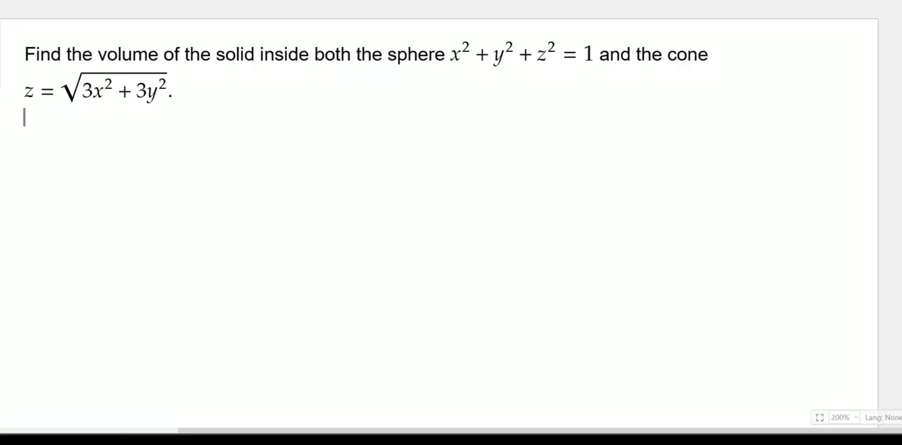

# Mathcha Toolkit

Mathcha Toolkit is a Tampermonkey userscript for `mathcha.io` that adds a faster solve, import, export, and AI-assisted workflow on top of the editor.

## Showcase

### Python Solver

The Python showcase highlights the local in-browser solver path for expressions that evaluate cleanly with Pyodide, SymPy, and `latex2sympy2-extended`, including integrals, limits, derivatives, sums, products, and matrix operations.



### AI Workflow

The AI showcase highlights the prompt handoff flow for selected Mathcha content, where the toolkit sends the current selection to one of the supported AI services for open-ended analysis or solving.



## Features

- Copy selected Mathcha content as LaTeX.
- Import LaTeX back into Mathcha.
- Solve the selected expression with an in-browser Python runtime powered by Pyodide and SymPy.
- Insert formatted answers directly at the current Mathcha selection.
- Cycle answer formats between exact fraction, decimal, and mixed number.
- Convert integer results to another base using syntax like `\rightarrow _{2}`.
- Open the current selection in external tools and chat apps.
- Open Symbolab for step-by-step solving.

## Supported AI Links

- Claude
- ChatGPT
- Google AI Studio
- You.com
- Perplexity
- Grok
- Mistral Le Chat

These links are configured in [src/config.ts](src/config.ts).

## Shortcuts

Hold `Ctrl+Alt` to show the shortcut tooltip inside Mathcha.

- `'` copy LaTeX
- `;` analyze with an AI tool
- `.` open in Symbolab
- `/` solve with Python and insert the answer
- `,` paste from LaTeX

## How It Works

The script prefers Mathcha runtime hooks over brittle menu automation when possible:

- runtime LaTeX extraction from the active editor selection
- direct import parsing through Mathcha's own LaTeX import logic
- in-browser solving through Pyodide, SymPy, and `latex2sympy2-extended`
- fallback DOM/menu paths when runtime access is unavailable

## Development

Install dependencies:

```bash
npm install
```

Useful commands:

```bash
npm run build
npm run typecheck
npm run pw:install
npm run pw:analyze
```

The userscript bundle is available at [mathcha-toolkit.user.js](https://github.com/yosef0H4/mathcha-toolkit/releases/latest/download/mathcha-toolkit.user.js).

## Notes

- The script only activates on `https://*.mathcha.io/*`.
- Some external AI links are best-effort and may change over time.
- Playwright helpers and runtime investigation notes live under [playwright](playwright) and [docs/mathcha-runtime-notes.md](docs/mathcha-runtime-notes.md).

## Credits

Mathcha Toolkit is an integration project built on top of other excellent tools.

Credit to the Mathcha team for building Mathcha. This project would not exist without a strong browser-based LaTeX editor to build around.

Credit to the Pyodide project for making it possible to run Python directly in the browser.

Credit to the SymPy project for the symbolic math engine used by the local solver.

Credit to the `latex2sympy2-extended` project for LaTeX-to-SymPy conversion, which makes the browser solver workflow practical.

This project mainly focuses on connecting these pieces into a faster workflow inside Mathcha.
